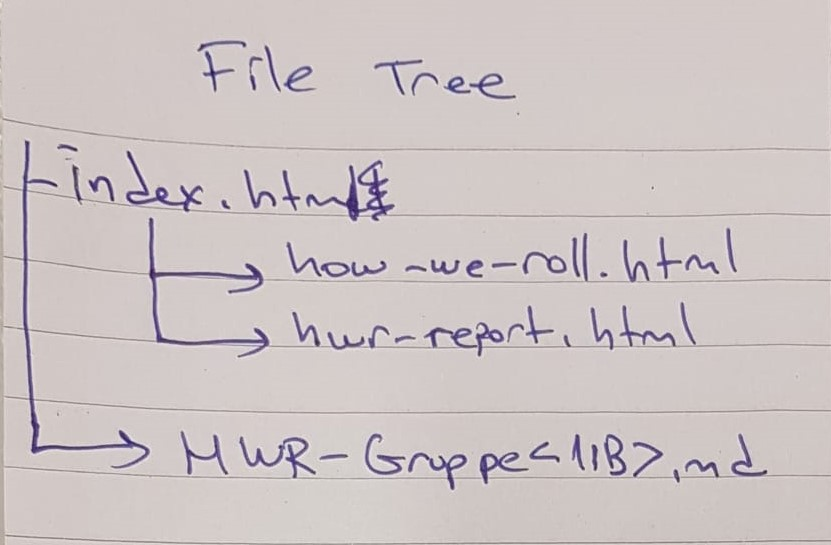
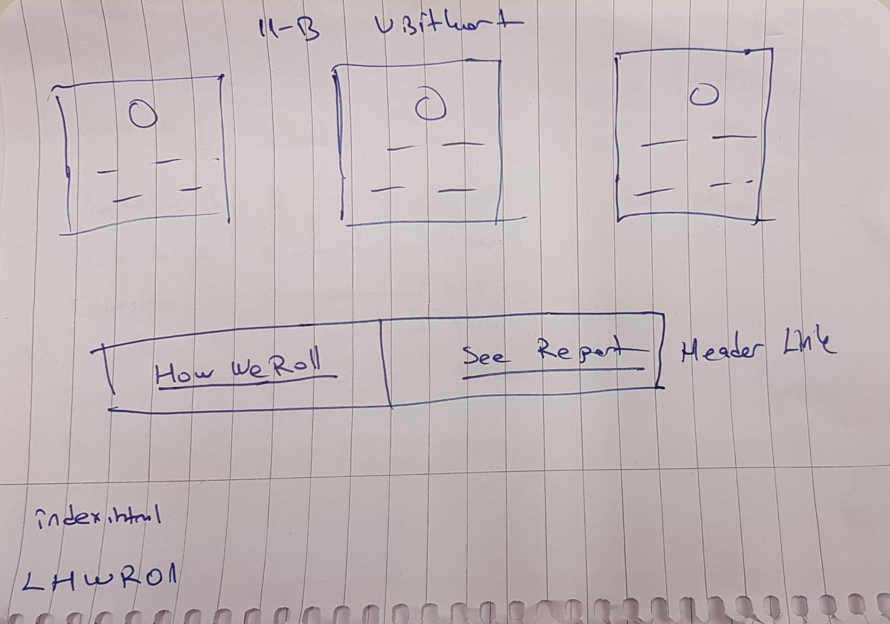
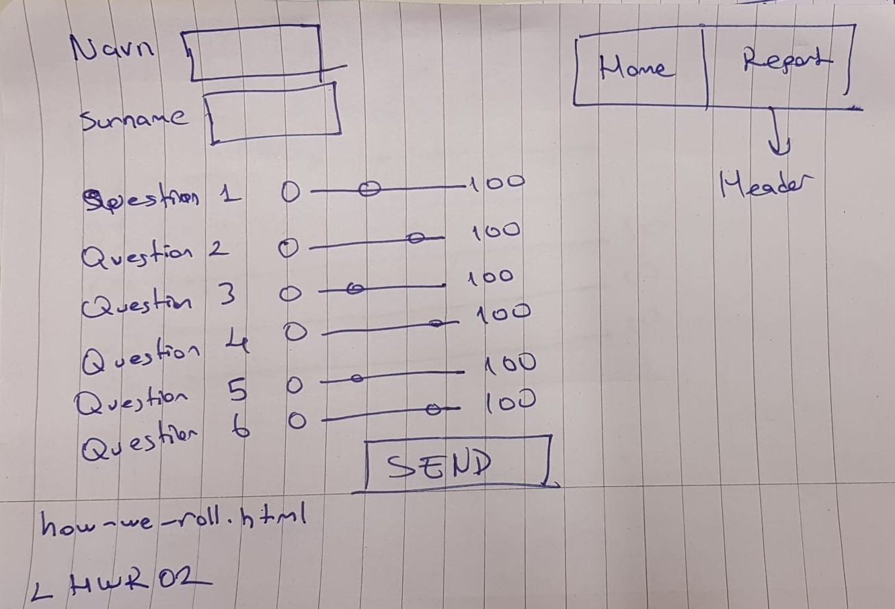
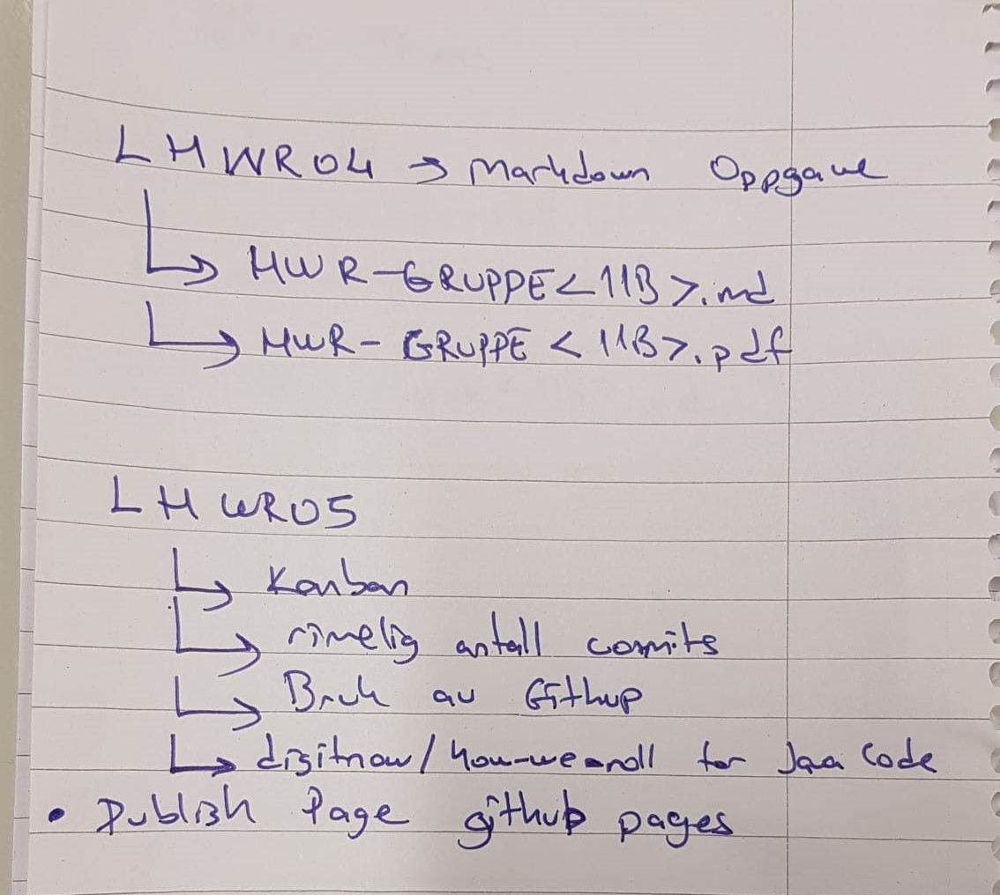

<h1> How we roll: Dokumentasjon og analyse av design
  <h2> Sammendrag av gruppearbeid </h2>

 Vi alle leste nøye gjennom oppgaveteksten, deretter startet vi med å lage skisser for userinterface, wireframes og brukerhistorier. Vi opprettet de forskjellige gjøremålene i GITHUB med hjelp av Kanban-bord og fordelte disse. Vi delte oss opp i to mindre grupper hvor de som hadde mest erfaring startet med HWR siden og rapport siden, mens resten lærte seg grunnleggende koding i tillegg til hvordan man skal navigere seg rundt på GITHUB og hvordan man Commit-er og Push-er. Vi ble enige om at det hadde vært smartere om vi heller hadde jobbet i par hvor en som kan litt mindre jobbet med en som kan litt mer, fordi vi opplevde at når vi delte oss i to grupper etter kompetanse ble det vanskelig å diskutere i felleskap når ting ble for teknisk.

Vi begynte med å bruke Kanban-bord hvor vi delte opp oppgaver, dette fungerte bra for oss da det ga oss en fin oversikt over prosessen i arbeidet. Andre verktøy vi brukte var Mozilla Developer Network, som ble brukt en god del gjennom hele prosjektet både for de av oss som kunne lite og skulle lære basic HTML og de som hadde mer kompetanse brukte det til litt mer avansert HTML og Javascript. Vi brukte IntelliJ og Visual Studio Code til koding. En online picture-converter, og såklart Github. Vi skulle bruke .gitignore for å skjule filer i Github, men siden vi ikke brukte det fra starten av, fikk vi ikke til å skjule de filene som allerede var opprettet.

Hvilke regler dere satt for bruke av hovedrepository og hvordan fungerte disse?
-Vi hadde alltid bare en branch, så når folk eksperimenterte i koden pushet de ikke opp før alle var enige og hadde fått sett på koden. De som var usikre i starten lagde egen branch for å teste seg frem lokalt, men gikk over til å bruke main branch når vi følte oss sikre. 

Hvordan sørget dere at alle lærer grunnleggende programmering i HTML og CSS (arbeid i par, arbeidmed alle, individuelt arbeid osv.)?
-Folk gjorde "hjemmelekser" også diskuterte vi arbeidet når vi var samlet i gruppetimer på skolen.

For at alle på gruppa skal forstå blant annet forkortelser i koden la vi inn kommentarer der dette måtte utdypes. Vi satte ikke in kildelenker i koden, på grunn av at det så litt rotete ut, så disse står lengre ned i markdown filen.

  <h2> Skisser </h2>

 File tree

Hovedside med visittkort

How we roll

Rapport

Oversikt over md-fil og Github-filer

<h2> Kilder

- https://developer.mozilla.org/en-US/docs/Web/HTML/Element/input/range
- https://css-tricks.com/styling-cross-browser-compatible-range-inputs-css/
- https://www.w3schools.com/html/html_layout.asp
- https://developer.mozilla.org/en-US/docs/Web/HTML/Element/form
- https://developer.mozilla.org/en-US/docs/Web/JavaScript/Reference/Global_Objects/JSON/parse

